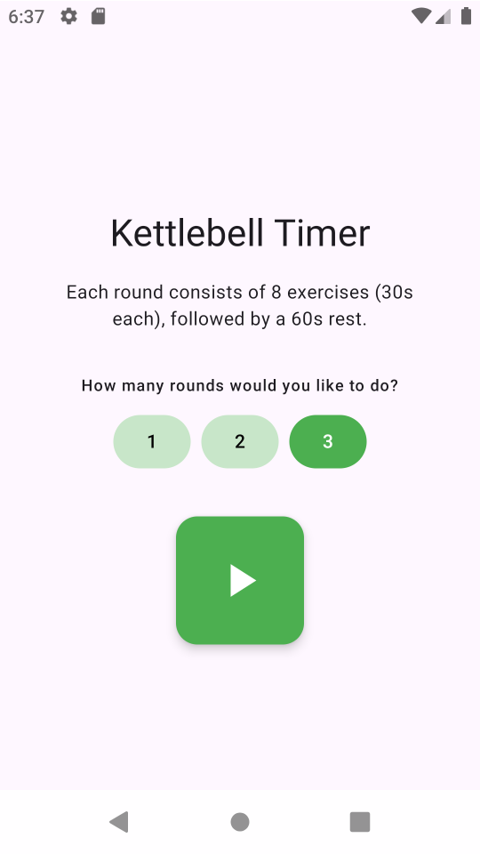
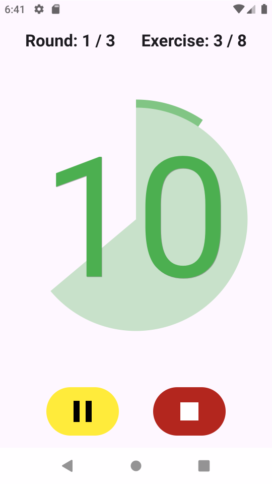

# Kettlebell Timer

A simple timer app designed for a specific workout format:

*   8 exercises
*   30 seconds per exercise
*   60 seconds of rest between rounds
*   1-3 rounds

## Features

*   **Minimalistic Design:** No fuss, just looks good and does what it's supposed to do.
*   **Screen Lock:** Keeps screen on during the workout.

## Screenshots

 

## Built With

*   Kotlin
*   Jetpack Compose
